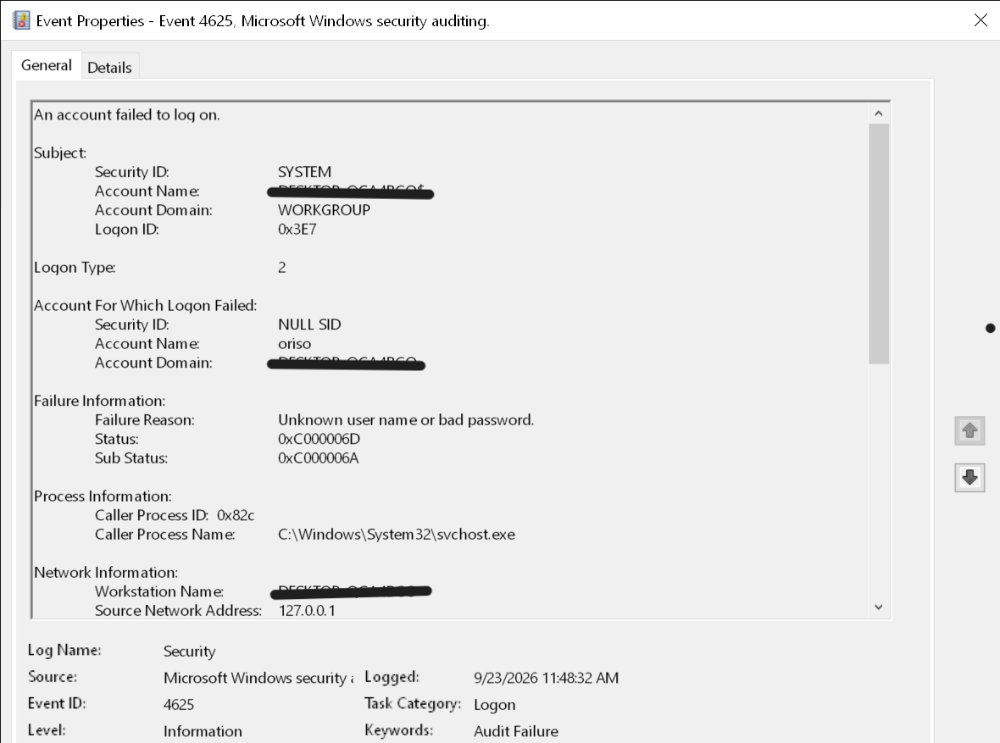

# Windows Event Log & Sysmon Notes

Hands-on notes from a 30-day SOC analyst study sprint.
Focus: Windows Security log, event IDs, Sysmon telemetry, and detection logic.

---

## Skills demonstrated

- Windows Security log analysis (4624, 4625, 4688, 7045, 1102)
- Logon type vs. sub-status interpretation
- Distinguishing benign vs. malicious authentication failures
- Sysmon event correlation *(in progress)*

---

- 
## Investigations

- [4624 — Logon types & baseline](investigations/4624-logon-types.md)
- [4625 — Failed logon: brute force vs user error](investigations/4625-brute-force-vs-spray.md)
- [4688 — Process creation + parent-child detection](investigations/4688-process-creation.md)
---

## Event ID reference *(in progress)*

| ID | Meaning |
|----|---------|
| 4624 | Successful logon |
| 4625 | Failed logon |
| 4634 | Logoff |
| 4672 | Special privileges assigned |
| 4688 | Process creation |
| 7045 | Service installed |
| 1102 | Audit log cleared |

---

## Logon types

| Type | Meaning |
|------|---------|
| 2 | Interactive (keyboard) |
| 3 | Network (SMB, share, PSExec) |
| 4 | Batch |
| 5 | Service |
| 10 | Remote Interactive (RDP) |

---

## Sample: 4625 failed logon filter

*6 failed logons over 4 days — all Logon Type 2, loopback source, single account → benign user error.*

*6 failed logons over 4 days — all Logon Type 2, loopback source, single account → benign user error.*
