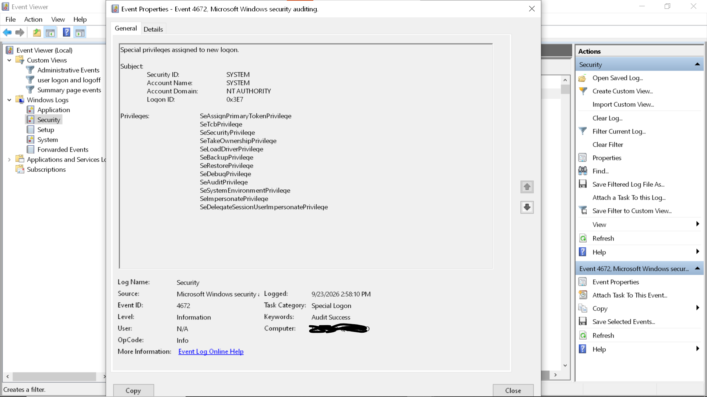
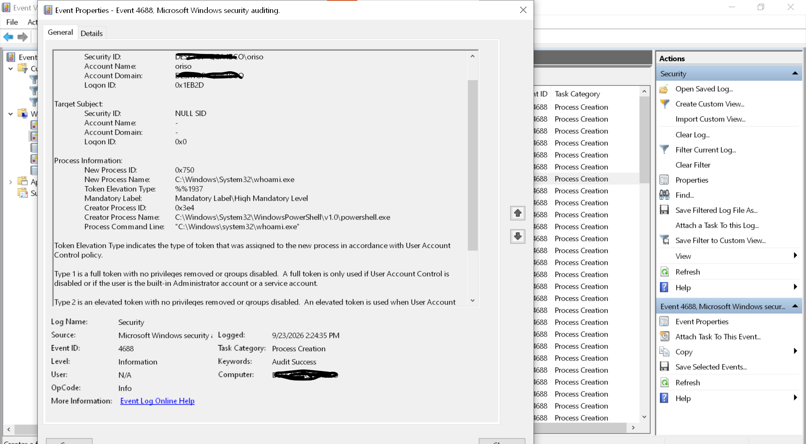
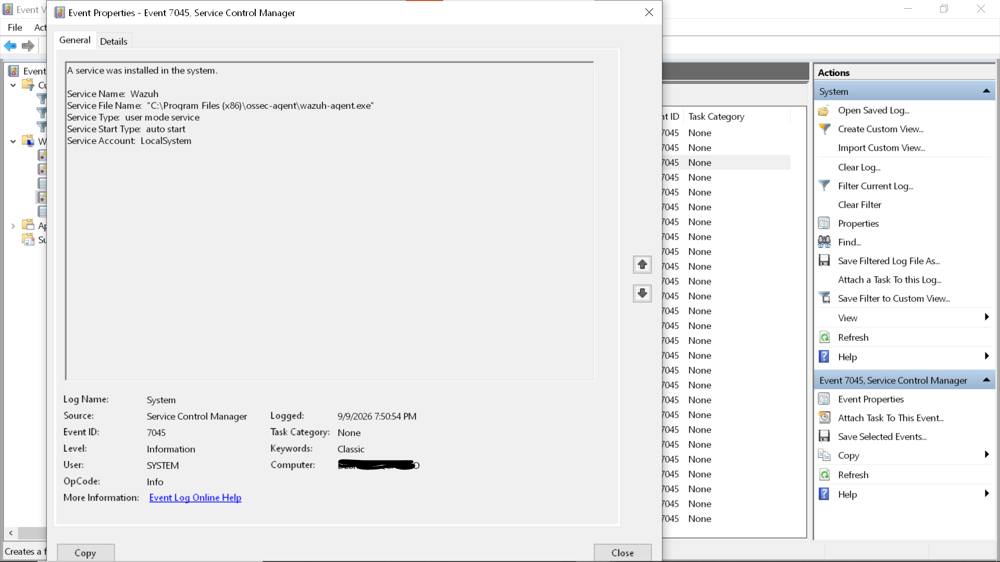

# Windows Event Log & Sysmon Notes

Hands-on notes from a 30-day SOC analyst study sprint.
Focus: Windows Security log, event IDs, Sysmon telemetry, and detection logic.

**Author:** [@michaelchris123-cmyk](https://github.com/michaelchris123-cmyk)

---

## Skills demonstrated

- Windows Security log analysis — 4624, 4625, 4672, 4688, 7045, 1102
- Windows System log analysis — service installs (7045), audit log clears (1102)
- Logon type vs. sub-status interpretation (Type 2/3/5/7/10, 0xC000006A)
- Distinguishing benign vs. malicious authentication failures
- Parent-child process analysis (4688) for execution detection
- Privilege analysis (4672) and DWM virtual account behavior
- PowerShell + XML event parsing for custom log summaries
- Service persistence detection (7045) with suspicious path heuristics
- Audit log tamper detection (1102) and session correlation via Logon ID
- Sysmon event correlation *(in progress)*

---

## Investigations

- [4624 — Logon types & baseline](investigations/4624-logon-types.md)
- [4625 — Failed logon: brute force vs user error](investigations/4625-brute-force-vs-spray.md)
- [4672 — Special privileges assigned](investigations/4672-special-privileges.md)
- [4688 — Process creation + parent-child detection](investigations/4688-process-creation.md)
- [7045 — Service install + persistence detection](investigations/7045-service-install.md)
- [1102 — Audit log cleared + session correlation](investigations/1102-audit-log-cleared.md)

---

## Event ID reference

| ID | Log | Meaning |
|----|-----|---------|
| 4624 | Security | Successful logon |
| 4625 | Security | Failed logon |
| 4634 | Security | Logoff |
| 4672 | Security | Special privileges assigned |
| 4688 | Security | Process creation |
| 7045 | System | Service installed |
| 1102 | Security | Audit log cleared |
| 104 | System | System log cleared |

---

## Logon types

| Type | Meaning |
|------|---------|
| 2 | Interactive (keyboard) |
| 3 | Network (SMB, share, PSExec) |
| 4 | Batch |
| 5 | Service |
| 7 | Unlock |
| 10 | Remote Interactive (RDP) |

---

## Failed logon sub-status codes

| Code | Meaning |
|------|---------|
| 0xC0000064 | Username does not exist |
| 0xC000006A | Correct user, wrong password |
| 0xC000006D | Generic bad credentials |
| 0xC0000234 | Account locked out |
| 0xC0000072 | Account disabled |

---

## PowerShell tooling

- [`powershell/4624-logon-type-summary.ps1`](powershell/4624-logon-type-summary.ps1) — count logons by type
- [`powershell/4688-process-creation-summary.ps1`](powershell/4688-process-creation-summary.ps1) — process creation with command lines
- [`powershell/4672-special-privileges-summary.ps1`](powershell/4672-special-privileges-summary.ps1) — special privileges by account
- [`powershell/7045-service-install-summary.ps1`](powershell/7045-service-install-summary.ps1) — service installs with paths

---

## Highlights

### 4625 — Benign vs. malicious failed logons

### 4672 — SYSTEM privilege baseline

### 4688 — Process creation with command line

### 7045 — Service install (Wazuh agent)

### 1102 — Audit log cleared (lab)

---

---

## Notes

All investigations performed on a personal lab workstation. Usernames,
hostnames, and IPs are local. No client or production data is included.
