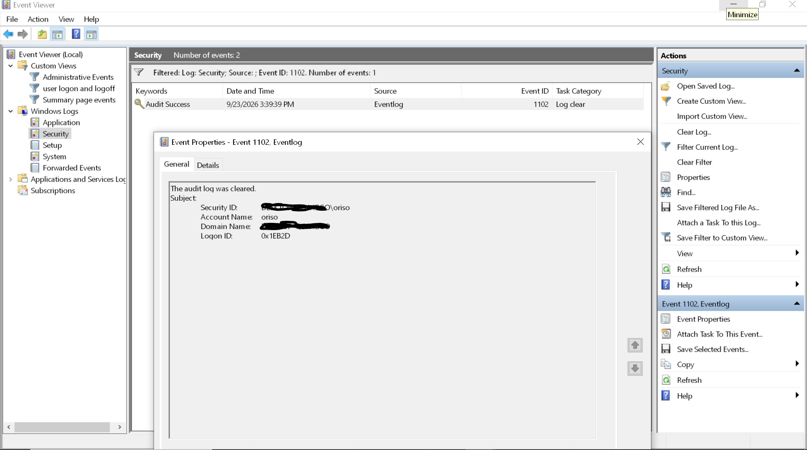

# 1102 — Audit Log Cleared

## Why 1102 matters
Fires when the Security audit log is cleared (`wevtutil cl Security`
or via Event Viewer). Almost never legitimate — a single event is
high-confidence evidence of an attacker covering their tracks.

**Critical weakness:** 1102 lives inside the log it describes. If an
attacker clears the log, the 1102 evidence is also destroyed locally.
Remote forwarding (SIEM/Splunk/Sysmon) is the only reliable way to
preserve it.

## Sample event (generated in lab)

| Field | Value | Interpretation |
|---|---|---|
| Event ID | 1102 | Audit log cleared |
| Source | Eventlog | Windows Event Log service |
| Log Name | Security | The log that was cleared |
| Task Category | Log clear | Specific action |
| Keywords | Audit Success | Windows logged the clear succeeded |
| Security ID | my desktop\oriso | The user who cleared it |
| Account Name | oriso | Local user account |
| Domain Name | my desktop | Local machine |
| Logon ID | 0x1EB2D | Session identifier |
| Computer | my destop | Local workstation |

## Verdict
Intentional lab test. In production, this event triggers immediate
investigation — no legitimate admin clears the Security log without
documented change control.

## The forensic problem
After clearing, this event is the **only event in the Security log**
until new activity accumulates. If an attacker clears twice, the 1102
from the first clear is also destroyed. Only remote log forwarding
preserves evidence.

## Session correlation — the analyst technique
The Logon ID field (`0x1EB2D`) links events across the same session:

    4624  (logon)        LogonID 0x1EB2D
    4672  (privileges)   LogonID 0x1EB2D
    4688  (process)      LogonID 0x1EB2D
    1102  (log cleared)  LogonID 0x1EB2D

Chain these to reconstruct a full session timeline. This works only if
the events were forwarded off-box before the clear.

## Detection strategy
- Alert on ANY 1102 — no exception
- Correlate with the 4624 preceding it (who was logged in)
- Correlate with 4688 (did `wevtutil.exe` run?)
- Correlate with 4672 (did the account just gain privileges?)
- Check for simultaneous clears of System, Application, PowerShell logs
- If SIEM in place, review events immediately preceding the clear

## Related events
- 104 — System log cleared (same concept, different log)
- 1102 — Security log cleared (this event)

## Real-world usage
- Ryuk, Conti, LockBit ransomware clear logs on every victim host
- APT groups routinely run `wevtutil cl` post-exploitation
- Insider threats clear logs to hide data theft
- PsExec-based lateral movement often clears remote logs
